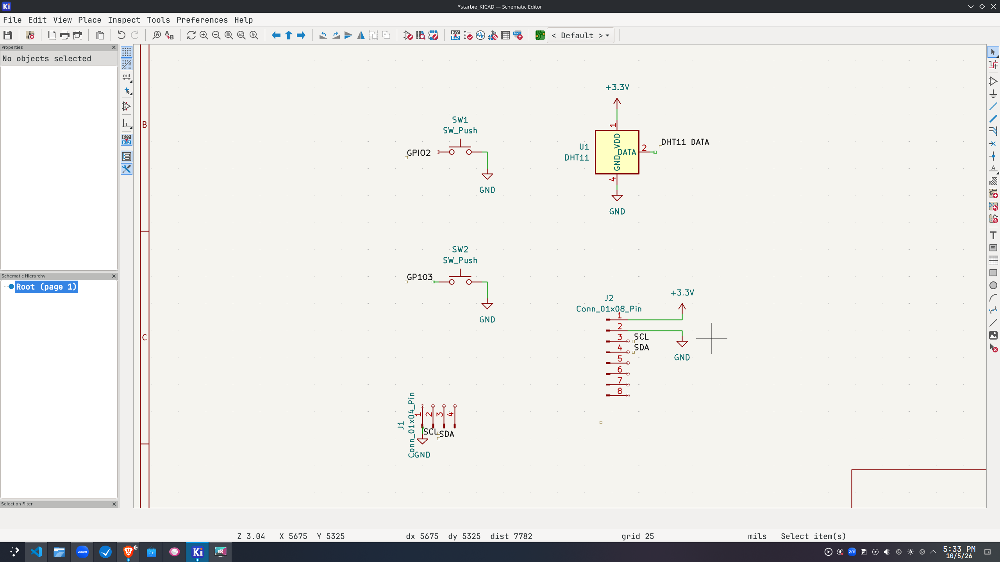
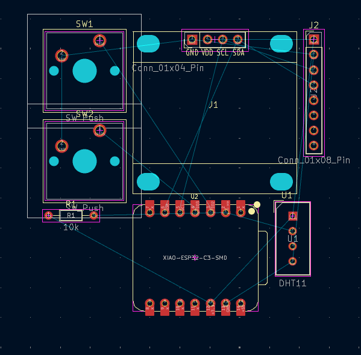
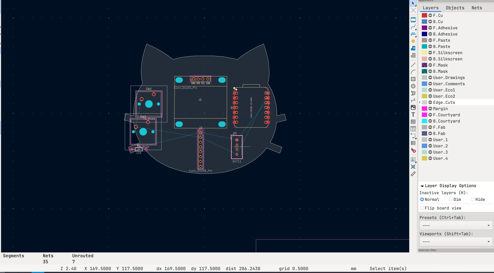
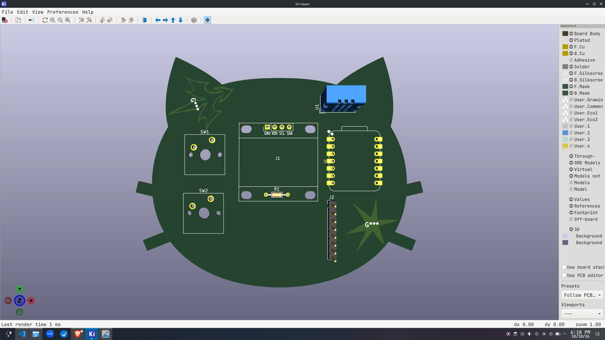

# Building cattie :)

I decided to go for the starbie idea because tI don't have any idea of how to do other PCB's or things 
But i think the idea is really cool!!

I've downloaded kicad and at first, it was a bit confusing because I didn't know how to initiliaze another library and also I didn't know
 how to label the components, but you can do it with L keyboard shorcut. 
 

Then, after i had everything in the right place, I update my PCB to schematic and the result was this!

After that I organize the hardware to the size of my figure I wanted to do for my PCB. I decided to go for a cat, because I really 
wanted to make something related to them. This is because I've always loved cats and it'll be fun to combine cats and coding!.

I routed the PCB and now it looked like this, I also added some tiny images to make it mine! 
